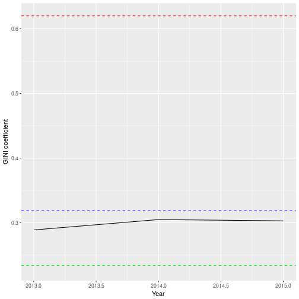

Shiny App to explore Inequality
========================================================
author: Codrin Kruijne
date: 17/04/2018
autosize: true

OECS Data on inequality
========================================================

- The goals of this app is to let the user explore how inequality has developed their country over the last decades.
- The dataset was obtained from [OECD data](https://data.oecd.org/inequality/income-inequality.htm)
- One way to measure inequality is the [GINI coefficient](https://en.wikipedia.org/wiki/Gini_coefficient)

App approach
========================================================

The user experience I want to create is to allow the user to:
- Select their country to see GINI inequality measurement over the years highlighted over other countries
- Toggle a checkbox to show the average over all countries to compare
- Toggle a checkbox to show the country with highest GINI increase
- Toggle a checkbox to show the country with highest GINI decrease

Imagined outcome
========================================================

A non interactive example would who this for The Netherlands:

